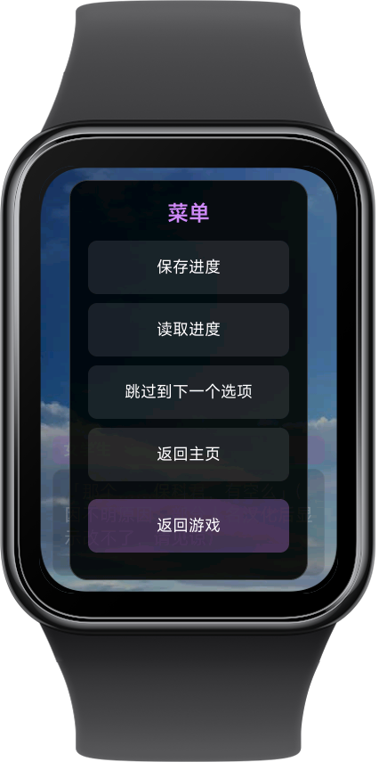
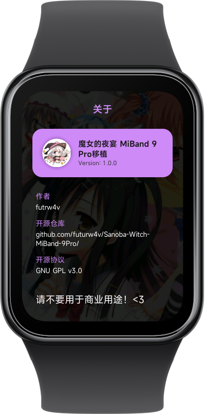

# Sanoba-Witch-MiBand-9Pro

[](https://www.gnu.org/licenses/gpl-3.0.html)


为小米手环9 Pro适配开发的《魔女的夜宴》移植

## 开发与维护声明

- 代码：本项目使用了较多AI，此项目完全只是心血来潮，本人并不熟悉JavaScript与HTML/CSS，代码质量较低，仅以实现功能为首要目标
- 维护：本人还要上学等，精力有限，随缘更新

## 预览
        

## 已实现功能

- [x] 完整剧本
- [x] UI 交互
- [x] 背景渲染
- [x] 存档与设置
- [x] 选项


## TODO

- [ ] 特殊 CG 与鉴赏
- [ ] 人物立绘渲染
- 最终目标是制作一个手环端的视觉小说框架


## 感谢名单

本项目的完成离不开以下团队、个人以及开源工具的帮助支持：

### 游戏内容
- 柚子社：游戏制作
- 暗鸽汉化组：提供原始汉化文本资源

### 技术
- [liuyuze61](https://github.com/liuyuze61)：部分代码与逻辑参考
- Gemini：代码辅助

### 工具
- [GARbro-Mod](https://github.com/crskycode/GARbro)
 & [FreeMote](https://github.com/UlyssesWu/FreeMote)：资源转换
- [KrkrExtract](https://github.com/xmoezzz/KrkrExtract)：资源提取
- [FFmpeg](https://ffmpeg.org/)：图片处理


## 剧本

本项目提供了一个剧本有关小工具，位于 `tool/convert_script.py` 下，用于给原始剧本做转换缩减等

注：输入的剧本文件应该以 `.json` 结尾，可以将原始以 `.scn` 结尾的剧本通过 [FreeMote](https://github.com/UlyssesWu/FreeMote) 中的 `PsbDecompile.exe` 转换为 `.json`


#### 用法：
```python
python convert_script.py <输入路径> <输出路径>
``` 

#### 数据结构
为了便于维护，此处提供了剧本的数据结构供给查看  
转换后的文件由一系列数组组成，每个数组的第一个元素为类型标识符：

| 标识符 | 类型 | 数组结构 | 说明 |
| :--- | :--- | :--- | :--- |
| **0** | **节点标签** | `[0, "label_name"]` | 标签/跳转点 |
| **1** | **背景** | `[1, "bg_name"]` | 用于背景切换 |
| **2** | **对话** | `[2, "说话人", "内容", [立绘列表]]` | 立绘列表可选，仅在立绘状态变化时出现 |
| **3** | **选项** | `[3, [["文字", "跳转", "表达式"]]]` | 分支选项及逻辑判断 |
| **4** | **章节标题** | `[4, "章节标题"]` | 更新章节标题 |


## 免责声明

仓库内的所有源代码、脚本等均以 [GNU General Public License v3.0](https://www.gnu.org/licenses/gpl-3.0.html) 协议开源


仓库内 `common/` 目录下的所有游戏素材版权均归Yuzusoft所有
- 这些资源不属于开源范畴
- 内置资源仅用于技术展示，请勿将其用于任何非法或商业用途
- 请在支持正版的前提下进行研究，若相关权利方认为本项目侵权，请联系删除